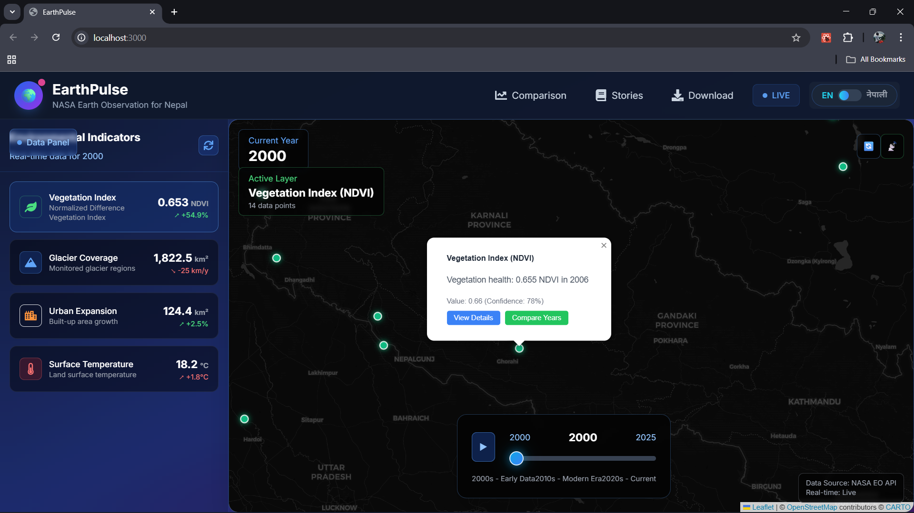
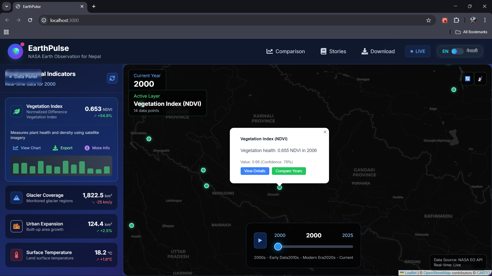
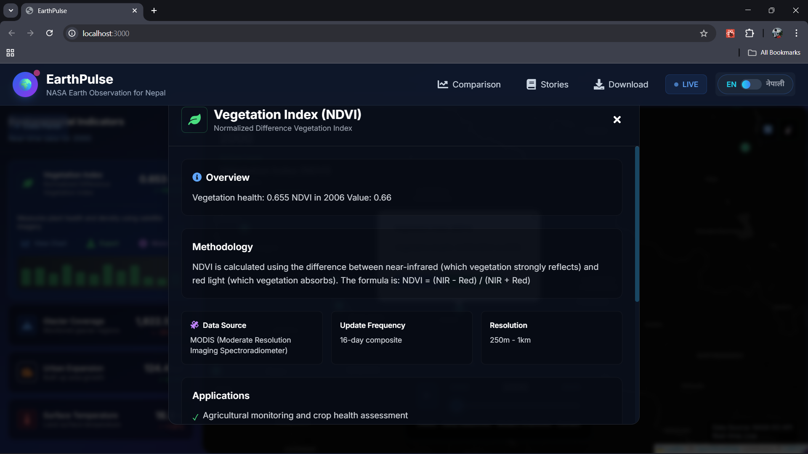
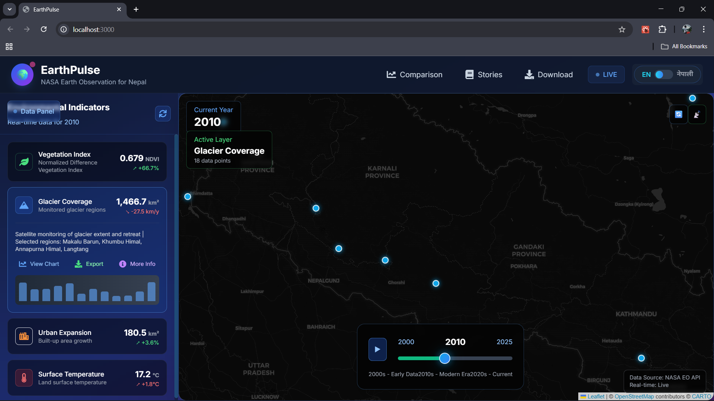
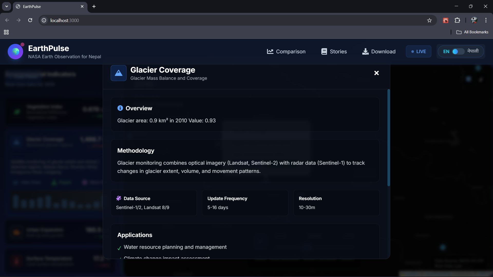
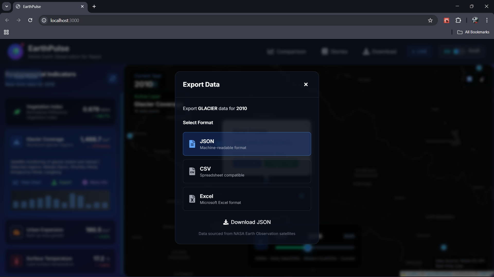
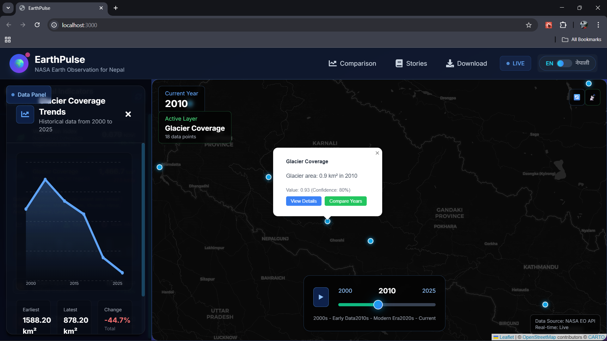
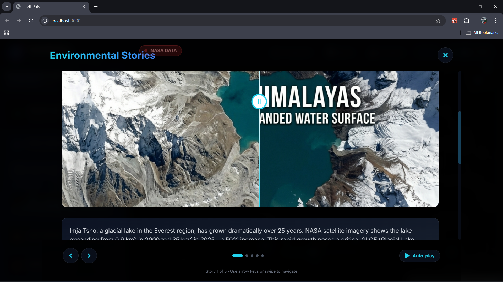
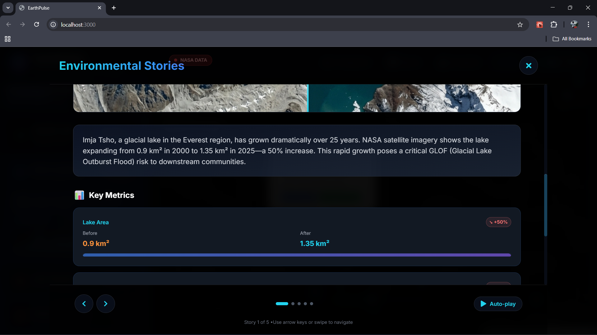

# EarthPulse

> **EarthPulse** — Interactive NASA Earth Observation data visualizer. Because staring at satellite images makes you feel like a responsible data scientist for approximately 10 seconds.

A modern React + FastAPI playground that brings together NASA-style earth observation data, interactive map visualizations, temporal analysis, and just enough polish to make you feel proud showing it to friends.

## Why I Built This

**The Professional Answer:**  
I wanted to build an end-to-end full-stack project that actually *means* something. Integrating geospatial data, async APIs, real-time map rendering, and a polished UI in one codebase seemed like a solid learning goal. Plus, environmental data visualization is genuinely cool—there's something satisfying about watching change unfold on a map over 25 years.

**The Real Answer:**  
I got tired of toy projects that only taught one thing. This one touches React, TypeScript, FastAPI, async Python, geospatial libraries, API integration, state management, animations, and deployment considerations—all without feeling like a tutorial project. Also, maps are awesome.

This repo is intentionally a *hobby project*—not production-hardened, but clean enough to learn from and extend. Think of it as "what I wish existed when I started learning full-stack development."

## What You Get

- **Frontend**: React + TypeScript + Vite, with Leaflet for mapping, Framer Motion for animations, TailwindCSS for styling, and Zustand for state. Includes time sliders, comparison tools, storytelling modals, and a responsive dashboard.
- **Backend**: FastAPI with async/await patterns, mock data simulation (so you can run it offline), and hooks for real NASA APIs. Includes geospatial processing libraries.
- **Dev Experience**: Hot reload on both frontend and backend. Mock data means you're not blocked by API keys during development.

## Tech Stack

**Frontend:**
- React 18 + TypeScript
- Vite (lightning-fast bundler)
- TailwindCSS + Framer Motion (styling + smooth animations)
- Leaflet + react-leaflet (interactive maps)
- @tanstack/react-query (data fetching)
- Zustand (lightweight state management)

**Backend:**
- FastAPI (async Python web framework)
- Uvicorn (ASGI server)
- Pydantic (data validation)
- Geospatial: rasterio, geopandas, shapely, pyproj
- Data processing: numpy, pandas, pillow, matplotlib

## Screenshots

Here's what the app looks like in action:

### Dashboard & Main Interface



### Map Visualization & Controls



### Data Analysis & Comparison Tools



### Advanced Features




## Quick Start

### Prerequisites
- **Node.js** 16+ and npm
- **Python** 3.10+
- Git

### 1. Clone the Repository

```powershell
git clone https://github.com/Aaditya-Nepal00/EarthPulse.git
cd EarthPulse
```

### 2. Frontend Setup (Terminal 1)

```powershell
cd 'C:\Users\aadit\OneDrive\Desktop\hobbyP\EarthPulse'
npm install
npm run dev
```

The dev server will start at `http://localhost:5173`. Vite will print the exact URL—open it in your browser.

### 3. Backend Setup (Terminal 2)

```powershell
cd 'C:\Users\aadit\OneDrive\Desktop\hobbyP\EarthPulse\backend'
pip install -r requirements.txt
```

Then run the server:

```powershell
uvicorn app.main:app --reload --port 8000
```

The API will be available at `http://localhost:8000`. Check `http://localhost:8000/api/docs` for interactive API documentation (in debug mode).

### 4. (Optional) Configure Environment

Create a `.env` file in the `backend/` folder to customize behavior:

```text
USE_MOCK_DATA=true
HOST=127.0.0.1
PORT=8000
DEBUG=true
LOG_LEVEL=INFO
# NASA_API_KEY=your_key_here  (optional, for real NASA data)
```

By default, the app runs with mock data, so you can test everything without needing API credentials.

### 5. Open the App

- Frontend: `http://localhost:5173`
- Backend API: `http://localhost:8000`
- API Docs: `http://localhost:8000/api/docs` (if DEBUG=true)

## Project Structure

```
EarthPulse/
├── backend/
│   ├── app/
│   │   ├── main.py              # FastAPI entry point
│   │   ├── config/
│   │   │   └── settings.py       # Configuration & environment vars
│   │   ├── routes/
│   │   │   ├── environmental.py  # Environmental data endpoints
│   │   │   ├── maps.py           # Map tile & service endpoints
│   │   │   └── reports.py        # Report generation endpoints
│   │   ├── services/
│   │   │   ├── nasa_api.py       # NASA API integration (mock + real)
│   │   │   ├── map_service.py    # Map processing & tiles
│   │   │   └── data_simulation.py # Mock data generation
│   │   ├── models/
│   │   │   ├── environmental.py  # Environmental data models
│   │   │   └── geographic.py     # Geographic data models
│   │   └── utils/
│   │       └── helpers.py        # Utility functions
│   └── requirements.txt
│
├── src/
│   ├── main.tsx                  # React entry point
│   ├── App.tsx                   # Main app layout
│   ├── components/
│   │   ├── MapContainer.tsx      # Leaflet map component
│   │   ├── TimeSlider.tsx        # Temporal controls
│   │   ├── EnvironmentalDashboard.tsx
│   │   ├── ComparisonTool.tsx
│   │   ├── StorytellingModal.tsx
│   │   ├── DownloadPanel.tsx
│   │   └── ...other components
│   ├── services/
│   │   └── api.ts                # Frontend API client
│   ├── i18n/
│   │   └── translations.ts       # Internationalization
│   └── data/
│       ├── stories.ts            # Sample data & narratives
│       └── glofLakes.ts          # Geographic data
│
├── package.json                  # Frontend dependencies
├── vite.config.ts                # Vite configuration
├── tsconfig.json                 # TypeScript config
├── tailwind.config.js            # TailwindCSS config
└── README.md                      # You are here
```

## How to Use (Basic Flow)

1. **Load the app** → Frontend boots, initializes the Leaflet map centered on Nepal Himalayas.
2. **Select an indicator** → Choose from NDVI, Glacier coverage, Urban expansion, or Temperature.
3. **Adjust the year** → Use the time slider to scrub through 2000–2025.
4. **Explore the data** → Map updates with new data; dashboard shows stats and trends.
5. **Compare regions** → Open the comparison tool to see side-by-side analysis.
6. **Download results** → Export data as charts, GeoJSON, or reports.

## Features

- **Interactive Maps** — Leaflet-based visualization with zoom, pan, and layer controls.
- **Time Series Analysis** — Scrub through 25+ years of environmental data.
- **Comparison Tool** — Side-by-side regional analysis.
- **Storytelling** — Narrative-driven insights tied to specific data points.
- **Data Export** — Download maps, charts, and raw data.
- **Responsive UI** — Works on desktop (mobile support in progress).
- **Mock Data by Default** — No API keys needed to get started.

## Common Issues & Troubleshooting

### Windows: Geospatial library installation fails
Geospatial libraries (`rasterio`, `geopandas`, `shapely`) require native C dependencies. Try:
- **Option A (Recommended)**: Use WSL (Windows Subsystem for Linux)
- **Option B**: Use conda instead of pip for the backend:
  ```powershell
  conda create -n earthpulse python=3.10
  conda activate earthpulse
  conda install -c conda-forge geopandas rasterio
  pip install -r requirements.txt
  ```

### Backend won't start — ModuleNotFoundError
Make sure you're running uvicorn from the correct directory. From the repo root:
```powershell
uvicorn backend.app.main:app --reload --port 8000
```

Or from the `backend/` folder:
```powershell
uvicorn app.main:app --reload --port 8000
```

### Frontend can't reach the backend
Check that the backend URL in `src/services/api.ts` matches where your backend is running (default: `http://localhost:8000`). Update if needed.

## Contributing / Extending

Want to add features or improve the project?

- **New Data Indicator?** Add a route in `backend/app/routes/environmental.py`, wire it to the frontend in `EnvironmentalDashboard.tsx`.
- **Real NASA APIs?** Implement actual calls in `backend/app/services/nasa_api.py` and toggle `USE_MOCK_DATA=false`.
- **Better UI?** The design is clean but minimal—Framer Motion is already in the stack, so animations are fair game.
- **Tests?** The backend has pytest configured. Add tests in a `tests/` folder.

## Notes & Caveats

- **Hobby Project Status**: This is *not* production-ready. It uses mock data, in-memory caching, and a few shortcuts. Deploy at your own risk.
- **No Real API Keys Built In**: I didn't hardcode NASA API keys (security: 1 point). To use real data, add your own key in `.env`.
- **Geospatial Dependencies**: Installing `rasterio` and `geopandas` on Windows can be finicky. WSL or conda are your friends.

## License

This project is free to use, modify, and share.

---

**Built with ☕ and occasional frustration by Aaditya.**

If you clone this and get it working, drop a star ⭐. If it breaks, file an issue and I'll help. If it works perfectly, assume I got lucky and move on.

